# team-02-watch
Watch Project Team 2
Bitte im Code keine ä,ö,ü benutzen....
Benutzt ae...oe...ue

Kopiertes README aus Maven Projekt Bachmann
# psit12-maven-lab-eclipse
Einfaches Maven Lab mit Eclipse

Die Zielsetzung dieser Anleitung ist ein einfaches Maven Projekt mittels Eclipse zu erstellen. Es soll gezeigt werden, wie die Abhängigkeiten von Junit und Mockito mittels Maven aufgelöst werden können. Die Maven-Plugins [maven-compiler-plugin](http://maven.apache.org/plugins/maven-compiler-plugin/index.html), maven-surefire-plugin und maven-site-plugin werden eingesetzt. 

## Inhaltsverzeichnis

1. [Voraussetzungen](#voraussetzungen)
1. [Eclipse - Workspace einstellen](#eclipse-workspace-einstellen)
1. [Neues Maven Projekt in Eclipse erstellen](#neues-maven-projekt-in-eclipse-erstellen)
1. [Aktuelles Projekt klonen](#aktuelles-projekt-klonen)
1. [Maven Plugins](#maven-plugins)
1. [Maven Dependencies](#maven-dependencies)
1. [Projekt starten](#projekt-starten)
1. [Projekt Site erstellen](#projekt-site-erstellen)
1. [Projekt testen](#projekt-testen)
1. [Weitere Maven Goals](#weitere-maven-goals)

 

## Voraussetzungen

Die Voraussetzung für die Durchführung des Labs sind:

* Java: JDK 8.0 [Download](http://www.oracle.com/technetwork/java/javase/downloads/index.htm) 
* Eclipse SE oder EE: [Download](https://www.eclipse.org/downloads/eclipse-packages/)
* Versionsverwaltung: Git [Download](https://git-scm.com/downloads) 
* Build-Automatisierung: Maven [Install](https://maven.apache.org/install.html) [Download](https://maven.apache.org/download.html) 
   Die Umgebungsvariable *JAVA_HOME* muss korrekt eingestellt sein und **java** muss im Datei-Pfad gefunden werden.   

 
 
## Eclipse Workspace einstellen 

Bitte folgende Einstellungen am Eclipse Workspace vornehmen:

**Codierung auf UTF-8 stellen:**

 

**Maven konfigurieren:** 

 

**Anzahl Zeichen der Konsole anpassen:** 

 
 
**Git konfigurieren:** 

 

## Neues Maven Projekt in Eclipse erstellen

Dazu im Menü auf File->Other..., dann Maven suchen und New Maven Project auswählen.

 

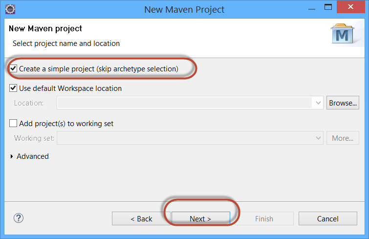

 

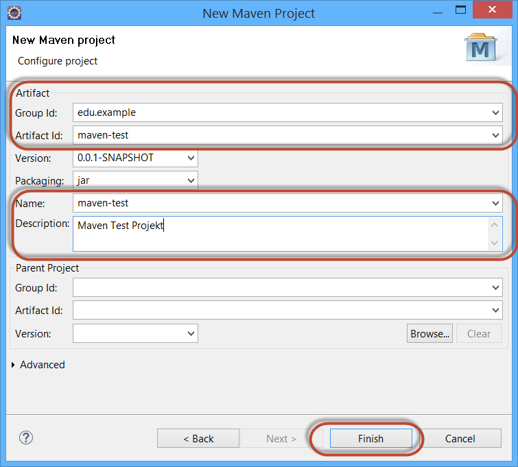

 

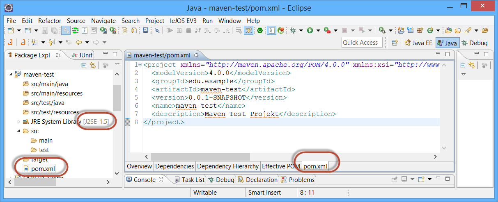

 

## Aktuelles Projekt klonen

Dazu *File->Import Project* aufrufen. Bei *Import Source* **git** definieren und *Projects von git* auswählen. 

Folgende URL auswählen: 

    https://github.engineering.zhaw.ch/bacn/psit12-maven-lab-eclipse 

Nach dem Import erscheinen diverse Fehler. Das ist normal, weil die Dependencies noch nicht definiert sind.

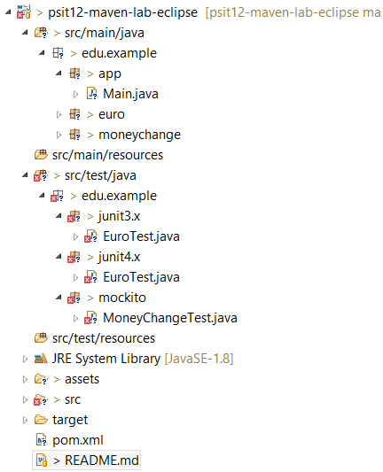

 

## Maven Plugins

Für die einzelnen Phasen im Lifecycle müssen zusätzliche Plugins eingebunden werden. Es werden folgende Plugins beschrieben:

1. [Maven Compiler Plugin](#maven-compiler-plugin)
2. [Maven Surefire-Plugin](#maven-surefire-plugin)
3. [Maven jar-Plugin](#maven-jar-plugin)

Eine Liste von Plugins ist kann [hier](http://maven.apache.org/plugins/) eingesehen werden.
 

### Maven Compiler-Plugin

Das Compiler Plugin wird benötigt um den Quellcode der Projekts zu kompilieren. Ohne weitere Angaben wird die Default Version 1.5 verwendet. Für die Verwendung von Java 8 muss das Plugin konfiguriert werden.

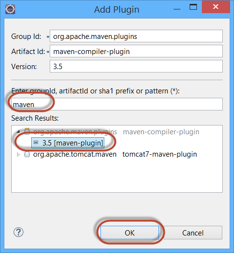

 

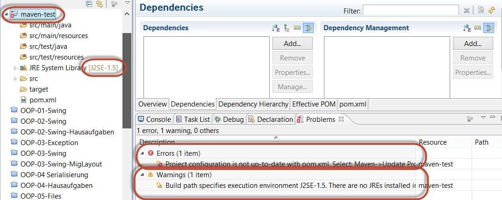

 

**Maven Update durchführen**

Nach jeder Änderung der POM-Datei muss Maven Update aufgerufen werden. Dazu auf dem Projekt das Kontextmenü mit der rechten Maustaste aufrufen.

 

 

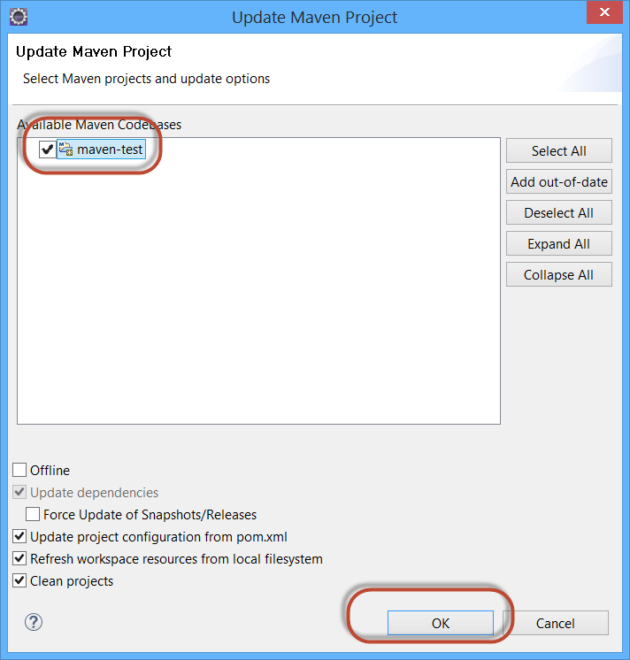

 

**Maven Compiler Plugin konfigurieren**

Für die Konfiguration gibt es zwei Varianten. Anbei die erste Variante durch die Definition von Properties. Die zweite Variante wird weiter unten beschrieben.

 

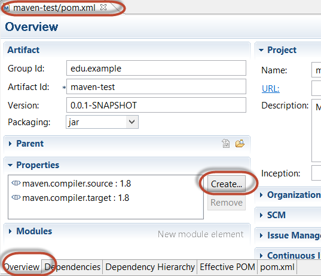

 

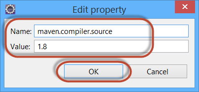

 

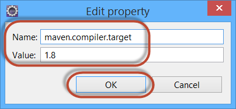

 

**Nach jeder POM-Änderung MAVEN->Update aufrufen**

 

** Nach dem Hinzufügen des maven-compile-plugins hat die POM-Datei folgenden Inhalt:**

    <project xmlns="http://maven.apache.org/POM/4.0.0" 
             xmlns:xsi="http://www.w3.org/2001/XMLSchema-instance"
             xsi:schemaLocation="http://maven.apache.org/POM/4.0.0
             http://maven.apache.org/xsd/maven-4.0.0.xsd">
	    <modelVersion>4.0.0</modelVersion>
	    <groupId>edu.example</groupId>
	    <artifactId>maven-test</artifactId>
	    <version>0.0.1-SNAPSHOT</version>
	    <name>maven-test</name>
	    <description>Maven Test Projekt</description>
	    <properties>
		    <maven.compiler.source>1.8</maven.compiler.source>
		    <maven.compiler.target>1.8</maven.compiler.target>
	    </properties>
	    <build>
		    <plugins>
			    <plugin>
				    <groupId>org.apache.maven.plugins</groupId>
				    <artifactId>maven-compiler-plugin</artifactId>
				    <version>3.5</version>
			    </plugin>
		    </plugins>
	    </build>
    </project>

 

Anbei die Konfiguration des [maven-compiler-plugins](http://maven.apache.org/plugins/maven-compiler-plugin/examples/set-compiler-source-and-target.html)

Alternativ kann die Konfiguration des Plugins betreffend Java-Versionnummer wie folgt durchgeführt werden:

    <plugin>
	    <groupId>org.apache.maven.plugins</groupId>
	    <artifactId>maven-compiler-plugin</artifactId>
	    <version>3.5</version>
        <configuration>
            <source>1.8</source>
            <target>1.8</target>
        </configuration>
    </plugin>

 

### Maven Surefire-Plugin

Das Surefile Plugin wird während der Test-Phase des Buildlifecycels benötigt um den Unit-Test einer Anwendung auszuführen. Es generiert einen Report in zwei unterschiedlichen Datei-Formaten:

* Plain text files (*.txt)
* XML files (*.xml)

Die Dateien werden an folgendem Ort erzeugt: ${basedir}/target/surefire-reports.

    <plugin>
       <groupId>org.apache.maven.plugins</groupId>
       <artifactId>maven-surefire-plugin</artifactId>
       <version>2.19.1</version>
    </plugin>
 

### Maven jar-Plugin

Das Maven jar-Plugin unterstützt die Packaging-Phase. Es kann zum Beispiel die Erstellung des Manifests beeinflussen:

    <plugin>
        <groupId>org.apache.maven.plugins</groupId>
        <artifactId>maven-jar-plugin</artifactId>
        <version>2.3.1</version>
        <configuration>
            <archive>
                <manifest>
                    <mainClass>edu.example.app.Main</mainClass>
                    <addClasspath>true</addClasspath>
                </manifest>
            </archive>
        </configuration>
    </plugin>
 

## Codierung in UTF-8

Die Codierung kann mittels weiteren Properties eingestellt werden:

    <project.build.sourceEncoding>UTF-8</project.build.sourceEncoding>
	<project.reporting.outputEncoding>UTF-8</project.reporting.outputEncoding>

 

## Maven Dependencies

Mit den Dependencies können die Abhängigkeiten hinzugefügt werden. Dazu kann in der POM-Ansicht mittels [Add] ein Dialog aufgerufen werden:

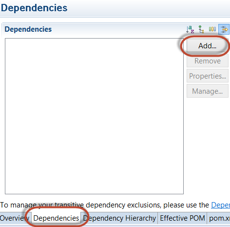

 

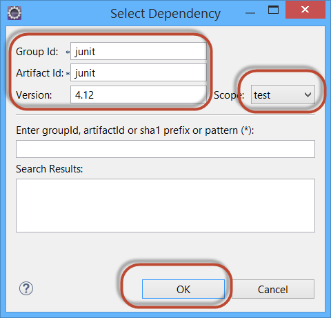

 

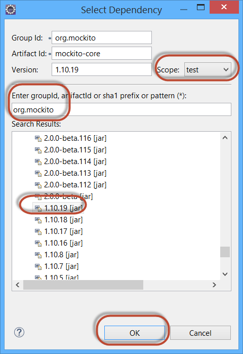

 

 

Anbei die Übersicht über die eingefügten Dependencies. Die Bibliothek Hamcrest wird von beiden Dependencies eingefügt. Deshalb muss diese bei Mockito mittels Exclusion wieder entfernt werden.

	<dependencies>
		<dependency>
			<groupId>junit</groupId>
			<artifactId>junit</artifactId>
			<scope>test</scope>
			<version>4.12</version>
		</dependency>
		<dependency>
			<groupId>org.mockito</groupId>
			<artifactId>mockito-core</artifactId>
			<version>1.10.19</version>
			<scope>test</scope>
            <exclusions>
               <exclusion>
                   <artifactId>hamcrest-core</artifactId>
                   <groupId>org.hamcrest</groupId>
               </exclusion>
            </exclusions>
		</dependency>
	</dependencies>

## Projekt starten

Die Main-Datei dieses Projekt gibt lediglich eine Meldung auf der Konsole aus. Interessanter sind die Unit-Test.

## Projekt Site erstellen

Die POM Datei kann um weitere Artefakte ergänzt werden:

* Reporting hinzufügen (Test-Reports und PMD-Reports)  
* Dokumentation hinzufügen (Source X-Reference und Javadoc)
* Deployment

Reporting und Dokumentation in der POM Datei hinzufügen:

    <reporting>
        <plugins>
            <plugin>
                <groupId>org.apache.maven.plugins</groupId>
                <artifactId>maven-surefire-report-plugin</artifactId>
                <version>2.12.4</version>
            </plugin>
			<plugin>
				<groupId>org.apache.maven.plugins</groupId>
				<artifactId>maven-pmd-plugin</artifactId>
				<version>3.7</version>
                <configuration>
                    <targetJdk>1.8</targetJdk>
                </configuration>			
            </plugin>
           <plugin>
               <groupId>org.apache.maven.plugins</groupId>
               <artifactId>maven-jxr-plugin</artifactId>
               <version>2.3</version>
           </plugin>
           <plugin>
               <groupId>org.apache.maven.plugins</groupId>
               <artifactId>maven-javadoc-plugin</artifactId>
               <version>2.9</version>
           </plugin>
        </plugins>
    </reporting>
    
     

## Projekt testen

Dazu muss mittels  Kontext-Menü *Run as-> Maven Build...* der untenstehende Dialog aufgerufen werden:

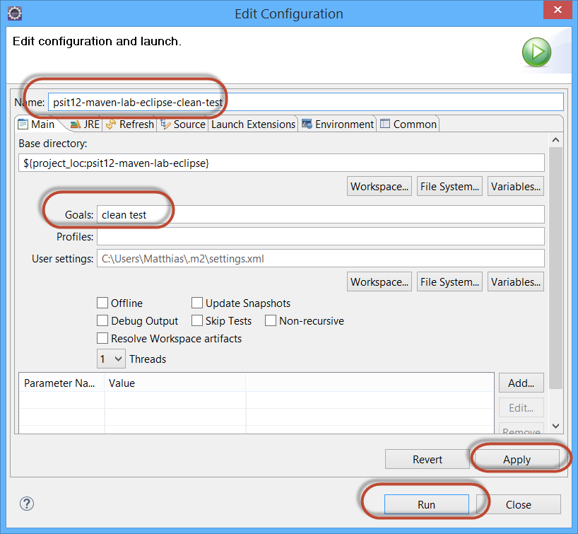

 

Anschliessend erscheint auf der Konsole der untenstehende Output:

    [INFO] Scanning for projects...
    [INFO]                                                                         
    [INFO] ------------------------------------------------------------------------
    [INFO] Building psit12-maven-lab-eclipse 0.0.1-SNAPSHOT
    [INFO] ------------------------------------------------------------------------
    [INFO] 
    [INFO] --- maven-clean-plugin:2.5:clean (default-clean) @ psit12-maven-lab-eclipse ---
    [INFO] Deleting F:\Dev\EE\JSP\psit12-maven-lab-eclipse\target
    [INFO] 
    [INFO] --- maven-resources-plugin:2.6:resources (default-resources) @ psit12-maven-lab-eclipse ---
    [INFO] Using 'UTF-8' encoding to copy filtered resources.
    [INFO] Copying 0 resource
    [INFO] 
    [INFO] --- maven-compiler-plugin:3.5:compile (default-compile) @ psit12-maven-lab-eclipse ---
    [INFO] Changes detected - recompiling the module!
    [INFO] Compiling 7 source files to F:\Dev\EE\JSP\psit12-maven-lab-eclipse\target\classes
    [INFO] 
    [INFO] --- maven-resources-plugin:2.6:testResources (default-testResources) @ psit12-maven-lab-eclipse ---
    [INFO] Using 'UTF-8' encoding to copy filtered resources.
    [INFO] Copying 0 resource
    [INFO] 
    [INFO] --- maven-compiler-plugin:3.5:testCompile (default-testCompile) @ psit12-maven-lab-eclipse ---
    [INFO] Changes detected - recompiling the module!
    [INFO] Compiling 3 source files to F:\Dev\EE\JSP\psit12-maven-lab-eclipse\target\test-classes
    [INFO] 
    [INFO] --- maven-surefire-plugin:2.19.1:test (default-test) @ psit12-maven-lab-eclipse ---
    -------------------------------------------------------
     T E S T S
    -------------------------------------------------------
    Running edu.example.junit3.x.EuroTest
    Tests run: 2, Failures: 0, Errors: 0, Skipped: 0, Time elapsed: 0.027 sec - in edu.example.junit3.x.EuroTest
    Running edu.example.junit4.x.EuroTest
    Tests run: 2, Failures: 0, Errors: 0, Skipped: 0, Time elapsed: 0.014 sec - in edu.example.junit4.x.EuroTest
    Running edu.example.mockito.MoneyChangeTest
    Tests run: 3, Failures: 0, Errors: 0, Skipped: 0, Time elapsed: 0.121 sec - in edu.example.mockito.MoneyChangeTest
    Results :
    Tests run: 7, Failures: 0, Errors: 0, Skipped: 0
    [INFO] ------------------------------------------------------------------------
    [INFO] BUILD SUCCESS
    [INFO] ------------------------------------------------------------------------
    [INFO] Total time: 4.940 s
    [INFO] Finished at: 2016-12-12T23:48:01+01:00
    [INFO] Final Memory: 15M/37M
    [INFO] ------------------------------------------------------------------------

Ein nächster Test kann direkt mittels Run aus der Toolbar aufgerufen werden:

 

Die generierten Daten können im target-Verzeichnis angeschaut werden. Dazu muss dieses zunächst mittels *F5* aktualisiert werden.

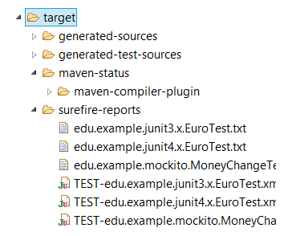
 

  

## Weitere Maven Goals

Versuchen Sie folgende Maven goals einzurichten:

*Aus Eclipse bzw. Konsole (navigieren zum Ort der POM-Datei): *

* mvn clean install

* mvn clean site:site

Im Verzeichnis target/site gibt es eine Datei index.html. Diese kann gestartet mittels Web Browser geöffnet werden.

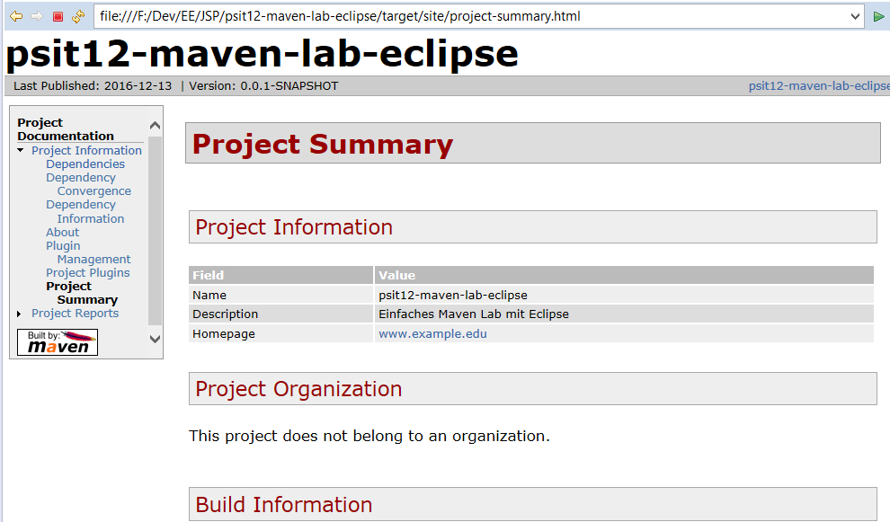

