# Projekt Uhr:

Watch Project Team 2 

Mitglieder: Tobias, Vianney,Amalie, Mohammed

##Inhaltsverzeichnis

1. [Einleitung](#einleitung)
1. [Ziele](#ziele)
1. [Randbedingungen](#randbedingungen)
1. [Build-Anleitung](#buil-anleitung)
1. [Kurze Bedienungsanleitung](#kurze-bedienungsanleitung)
1. [User Stories](#user-stories)
1. [Releaseplan](#releaseplan)
1. [Dokumentation Sprint 1](#dokumentation-sprint-1)
    + [Taskliste der User Stories](#taskliste-der-user-stories)
    + [UML Klassen- und Sequenzdiagramme](#uml-klassen-und-sequenzdiagramme)
    + [Dokumentation wichtiger Code Snippets](#dokumentation-wichtiger-code-snippets)
    + [Testfaelle bedingt durch Akzeptanzkritierium](#testfaelle-bedingt-durch-akzeptanzkritierium)
    
1. [Dokumentation Sprint 2](#dokumentation-sprint-2)
    + [Taskliste der User Stories](#taskliste-der-user-stories)
    + [UML Klassen- und Sequenzdiagramme](#uml-klassen-und-sequenzdiagramme)
    + [Dokumentation wichtiger Code Snippets](#dokumentation-wichtiger-code-snippets)
    + [Testfaelle bedingt durch Akzeptanzkritierium](#testfaelle-bedingt-durch-akzeptanzkritierium)
    
1. [Dokumentation Sprint 3](#dokumentation-sprint-3)
    + [Taskliste der User Stories](#taskliste-der-user-stories)
    + [UML Klassen- und Sequenzdiagramme](#uml-klassen-und-sequenzdiagramme)
    + [Dokumentation wichtiger Code Snippets](#dokumentation-wichtiger-code-snippets)
    + [Testfaelle bedingt durch Akzeptanzkritierium](#testfaelle-bedingt-durch-akzeptanzkritierium)
    
1. [Dokumentation Sprint 4](#dokumentation-sprint-4)
    + [Taskliste der User Stories](#taskliste-der-user-stories)
    + [UML Klassen- und Sequenzdiagramme](#uml-klassen-und-sequenzdiagramme)
    + [Dokumentation wichtiger Code Snippets](#dokumentation-wichtiger-code-snippets)
    + [Testfaelle bedingt durch Akzeptanzkritierium](#testfaelle-bedingt-durch-akzeptanzkritierium)    
    

## Einleitung 

Dieses Git- Repository enstand im Rahmen  der Kurse Software Engieering und Programmieren mit Java.

## Ziele

Ziel ist es die in den Kursen erlenten Fähigkeiten und Kompetenzen innerhalb eines einzig Projektes zu beweisen.

## Randbedingungen

Zum Nachbauen:

Java: JDK 8.0 
Eclipse EE
Build-Automatisierung: Maven

Die Umgebungsvariable JAVA_HOME muss korrekt eingestellt sein und java muss im Datei-Pfad gefunden werden. 

Einfaches Ausführen: 

Java: JDK 8.0 

## Buil-Anleitung

Laden Sie sich die Datei xyz.jar auf ihren Pc runter. Und führen Sie sie aus.

## Kurze Bedienungsanleitung

Zum Starten der Uhr drücken Sie bitte auf Start. Sie können die Uhr mittels Stop anhalten. Unter Einstellungen können Sie die Farben und die Schriftgröße ändern.  

## User Stories

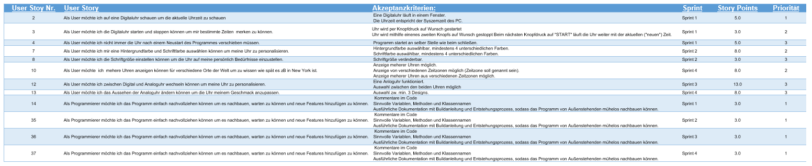

## Releaseplan

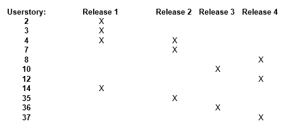

## Dokumentation Sprint 1
#### Taskliste der User Stories

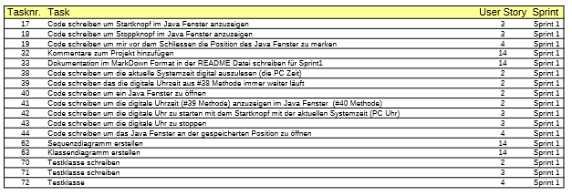

#### UML Klassen- und Sequenzdiagramme

Das Klassendiagramm:

Das Sequenzdiagramm:

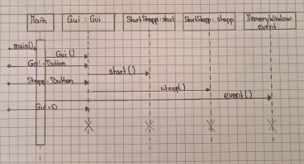

#### Dokumentation wichtiger Code Snippets
Unser Mainprogram: 

 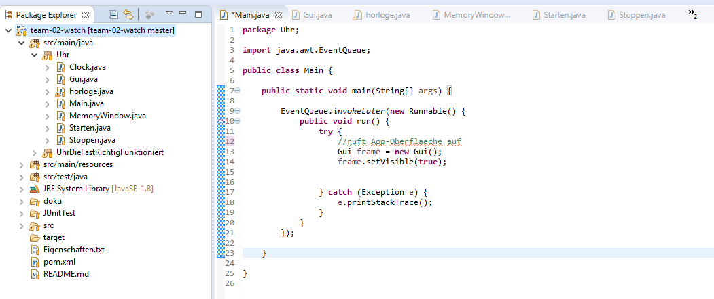
 
Das Appletdesign: 

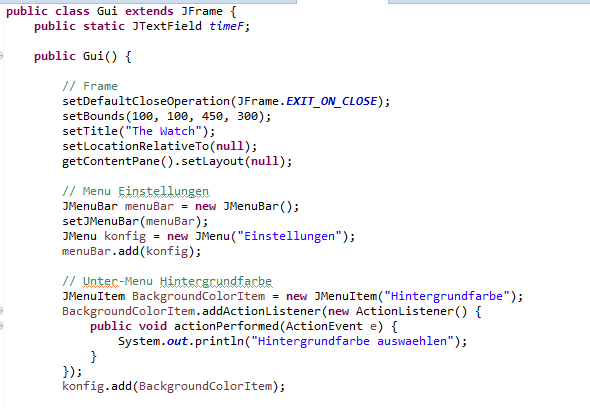

Inklusive des erstellen der Buttons:

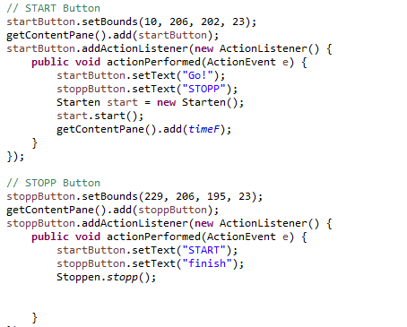

Die Klasse zum starten der Uhr:

Die Klasse zum stoppen der Uhr ist ählich aufgebaut wie die Startklasse.

Um die Positon des Fensters zu speichern haben wir uns fogendes überlegt:

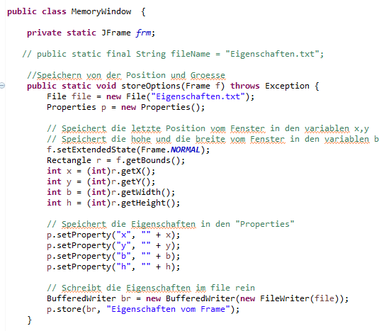

#### Testfaelle bedingt durch Akzeptanzkritierium
## Dokumentation Sprint 2
#### Taskliste der User Stories

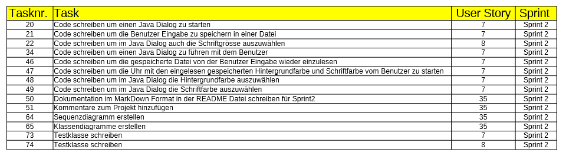

#### UML Klassen- und Sequenzdiagramme
#### Dokumentation wichtiger Code Snippets

Der Fokus in diesem Sprint lag auf dem erstellen der Farbauswahl für Schrift- und Hintergrund, sowie die Schriftgröße.
Dementsprechend sind alle neuen Klassen recht ählich. Hier unten beispielhaft die Klasse zur Hintergrundsauswahl: 

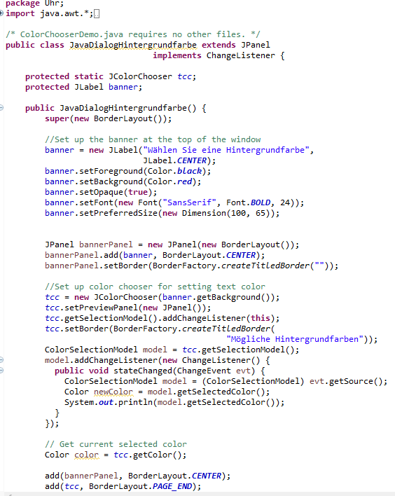

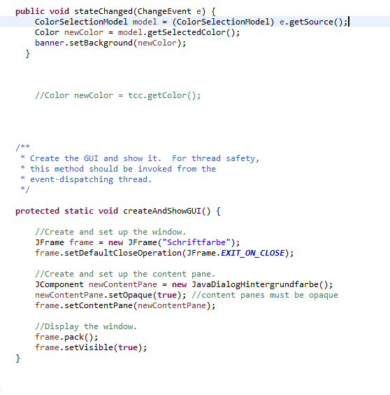
s
#### Testfaelle bedingt durch Akzeptanzkritierium
## Dokumentation Sprint 3
#### Taskliste der User Stories

)

#### UML Klassen- und Sequenzdiagramme
#### Dokumentation wichtiger Code Snippets
#### Testfaelle bedingt durch Akzeptanzkritierium
## Dokumentation Sprint 4
#### Taskliste der User Stories

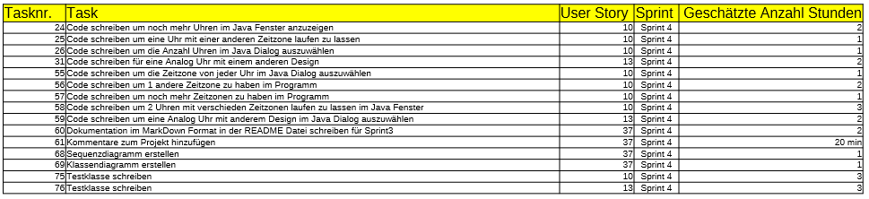

#### UML Klassen- und Sequenzdiagramme
#### Dokumentation wichtiger Code Snippets
#### Testfaelle bedingt durch Akzeptanzkritierium

