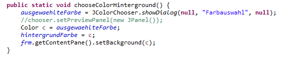

# Projekt Uhr:

Watch Project Team 2 

Mitglieder: Tobias, Vianney,Amalie, Mohammed

##Inhaltsverzeichnis

1. [Einleitung](#einleitung)
1. [Ziele](#ziele)
1. [Randbedingungen](#randbedingungen)
1. [Build-Anleitung](#buil-anleitung)
1. [Kurze Bedienungsanleitung](#kurze-bedienungsanleitung)
1. [User Stories](#user-stories)
1. [Releaseplan](#releaseplan)
1. [Dokumentation Sprint 1](#dokumentation-sprint-1)
    + [Taskliste der User Stories](#taskliste-der-user-stories)
    + [UML Klassen- und Sequenzdiagramme](#uml-klassen-und-sequenzdiagramme)
    + [Dokumentation wichtiger Code Snippets](#dokumentation-wichtiger-code-snippets)
    + [Testfaelle bedingt durch Akzeptanzkritierium](#testfaelle-bedingt-durch-akzeptanzkritierium)
    
1. [Dokumentation Sprint 2](#dokumentation-sprint-2)
    + [Taskliste der User Stories](#taskliste-der-user-stories)
    + [UML Klassen- und Sequenzdiagramme](#uml-klassen-und-sequenzdiagramme)
    + [Dokumentation wichtiger Code Snippets](#dokumentation-wichtiger-code-snippets)
    + [Testfaelle bedingt durch Akzeptanzkritierium](#testfaelle-bedingt-durch-akzeptanzkritierium)
    
1. [Dokumentation Sprint 3](#dokumentation-sprint-3)
    + [Taskliste der User Stories](#taskliste-der-user-stories)
    + [UML Klassen- und Sequenzdiagramme](#uml-klassen-und-sequenzdiagramme)
    + [Dokumentation wichtiger Code Snippets](#dokumentation-wichtiger-code-snippets)
    + [Testfaelle bedingt durch Akzeptanzkritierium](#testfaelle-bedingt-durch-akzeptanzkritierium)
    
1. [Dokumentation Sprint 4](#dokumentation-sprint-4)
    + [Taskliste der User Stories](#taskliste-der-user-stories)
    + [UML Klassen- und Sequenzdiagramme](#uml-klassen-und-sequenzdiagramme)
    + [Dokumentation wichtiger Code Snippets](#dokumentation-wichtiger-code-snippets)
    + [Testfaelle bedingt durch Akzeptanzkritierium](#testfaelle-bedingt-durch-akzeptanzkritierium)    
    

## Einleitung 

Dieses Git- Repository enstand im Rahmen  der Kurse Software Engieering und Programmieren mit Java.

## Ziele

Ziel ist es die in den Kursen erlenten Fähigkeiten und Kompetenzen innerhalb eines einzig Projektes zu beweisen.
Dazu sollen wir in einem Team eine Uhr mit verschiedenen Funktionen und Eigenschaften programmieren. 

## Randbedingungen

Zum Nachbauen:

Java: JDK 8.0 
Eclipse EE

Die Umgebungsvariable JAVA_HOME muss korrekt eingestellt sein und java muss im Datei-Pfad gefunden werden. 

Einfaches Ausführen: 

Java: JRE 

## Buil-Anleitung

    -Laden Sie sich die Datei .jar auf ihren Pc runter. 
    -Vergewissern Sie sich, dass Sie eine Java Runtime Environment auf Ihrem PC haben.
    -Führen Sie die Datei durch einen Doppelklick auf ebenjene aus. Alternativ können Sie auch über die Konsole die Datei mit: java -Name.jar ausführen. 
    

## Kurze Bedienungsanleitung

Zum Starten der Uhr drücken Sie bitte auf Start. Sie können die Uhr mittels Stop anhalten. Unter Einstellungen können Sie die Farben ändern.  Nach Wunsch können sie auch zur Analoguhr umschalten.  

## User Stories

## Releaseplan

## Dokumentation Sprint 1
#### Taskliste der User Stories

#### UML Klassen- und Sequenzdiagramme

Das Klassendiagramm:

Für das Klassendiagramm haben wir am Anfang 4 Klassen. Eine Mainklasse sowie eine Klasse zum starten und stoppen der Uhr,
zum Speichern der Positon des Fensters und eine die die Oberfläche bildet. 

Das Sequenzdiagramm:

#### Dokumentation wichtiger Code Snippets
Unser Mainprogram: 

 
 
Das Appletdesign: 

Inklusive des erstellen der Buttons:

Die Klasse zum starten der Uhr:

Die Klasse zum stoppen der Uhr ist ählich aufgebaut wie die Startklasse.

Um die Positon des Fensters zu speichern haben wir uns fogendes überlegt:

#### Testfaelle bedingt durch Akzeptanzkritierium

######Testfälle:

    +Nach dem Starten des Programmes läuft die Uhr (wenn man auf Start dückt).
    +Die Uhrzeit stimmt mit der vom PC überein.
    +Die Uhr ist stoppbar.Die Zeit bleibt stehen und wird weiterhin angezeigt.
    +Sie kann wieder gestarten werden. 
    +Start und Stopp ist beliebig oft ausführbar.
    +Beim wiederaufrufen des Programms öffnet sich die Uhr an der gleichen Stelle, wie beim schließen.
    
######Resultat:

Alle Testversuche waren erfolgreich.    
       
## Dokumentation Sprint 2
#### Taskliste der User Stories

#### UML Klassen- und Sequenzdiagramme

#### Dokumentation wichtiger Code Snippets

Der Fokus in diesem Sprint lag auf dem erstellen der Farbauswahl für Schrift- und Hintergrundfarbe.

Dementsprechend sind alle neuen Klassen und Methoden recht ählich. Hier unten beispielhaft die Methode zur Hintergrundsauswahl: 

#### Testfaelle bedingt durch Akzeptanzkritierium
######Testfälle:

Die alten Funktionen der Uhr sollen natürlich erhalten bleiben:

    +Nach dem Starten des Programmes läuft die Uhr (wenn man auf Start dückt).
    +Die Uhrzeit stimmt mit der vom PC überein.
    +Die Uhr ist stoppbar.Die Zeit bleibt stehen und wird weiterhin angezeigt.
    +Sie kann wieder gestarten werden. 
    +Start und Stopp ist beliebig oft ausführbar.
    +Beim wiederaufrufen des Programms öffnet sich die Uhr an der gleichen Stelle, wie beim schließen.

Zusätzlich kommen hinzu:
     
     +Der Nutzer kann mehrmals hintereinander die Schriftfarbe ändern.
     +Der Nutzer kann mehrmals hintereinander die Hintergrundfarbe ändern.
     +Beim Neustart werden die letzt ausgewählten Farben präsentiert.
    
         
######Resultat:

Die Digitaluhr läuft wieim Sprint 1. Zusätzlich können die Farben im Programmablauf geändert werden. Leider haben wir es nicht geschafft Sie beim nächsten Start wieder aufzurufen. 

## Dokumentation Sprint 3
#### Taskliste der User Stories

#### UML Klassen- und Sequenzdiagramme

#### Dokumentation wichtiger Code Snippets

Eine der schwereren Codebestandteile war das programmieren des Blattes: 

Implementierung der Uhr im Menu der anderen:

#### Testfaelle bedingt durch Akzeptanzkritierium

Die alten Funktionen der Uhr sollen natürlich erhalten bleiben:

    +Nach dem Starten des Programmes läuft die Uhr (wenn man auf Start dückt).
    +Die Uhrzeit stimmt mit der vom PC überein.
    +Die Uhr ist stoppbar.Die Zeit bleibt stehen und wird weiterhin angezeigt.
    +Sie kann wieder gestarten werden. 
    +Start und Stopp ist beliebig oft ausführbar.
    +Beim wiederaufrufen des Programms öffnet sich die Uhr an der gleichen Stelle, wie beim schließen. 
    +Der Nutzer kann mehrmals hintereinander die Schriftfarbe ändern.
    +Der Nutzer kann mehrmals hintereinander die Hintergrundfarbe ändern.
    +Beim Neustart werden die letzt ausgewählten Farben präsentiert.

Zusätzlich kommen hinzu:

    +Eine Analoguhr ist startbar über ein Untermenu. Sie zeigt die aktuelle Zeit an.
    

######Resultat:

Die Analoguhr lässt sich problemlos aufrufen, leider ist danach keine Rückkehr zur Digitaluhr möglich. An der Funktionsweise der Digitaluhr ändert sich nichts.

## Dokumentation Sprint 4
#### Taskliste der User Stories

#### UML Klassen- und Sequenzdiagramme
#### Dokumentation wichtiger Code Snippets
#### Testfaelle bedingt durch Akzeptanzkritierium

######Testfälle:

Die alten Funktionen der Uhr sollen natürlich erhalten bleiben:

    +Nach dem Starten des Programmes läuft die Uhr (wenn man auf Start dückt).
    +Die Uhrzeit stimmt mit der vom PC überein.
    +Die Uhr ist stoppbar.Die Zeit bleibt stehen und wird weiterhin angezeigt.
    +Sie kann wieder gestarten werden. 
    +Start und Stopp ist beliebig oft ausführbar.
    +Beim wiederaufrufen des Programms öffnet sich die Uhr an der gleichen Stelle, wie beim schließen. 
    +Der Nutzer kann mehrmals hintereinander die Schriftfarbe ändern.
    +Der Nutzer kann mehrmals hintereinander die Hintergrundfarbe ändern.
    +Beim Neustart werden die letzt ausgewählten Farben präsentiert.

Zusätzlich kommen hinzu:
     
     +mehere Uhren laufen gemeinsam.
     +mehere Uhren laufen gemainsam, aber in unterschiedlichen Zeitzonen.
     +Das Design der Uhr kann dauerhaft verändert werden. Es sind mehere unterschiedliche Designs möglich. 
     
    
     
         
######Resultat:

